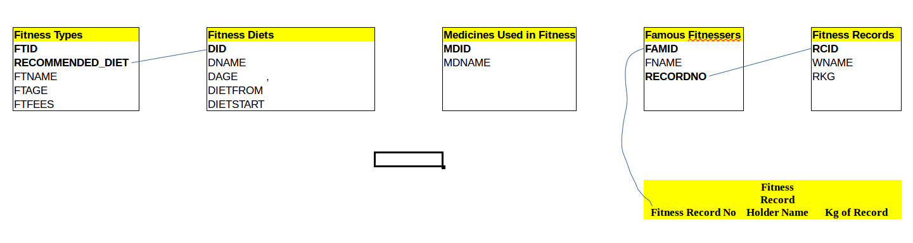

Parts Implemented by Maqsood Ahmad Lemar
========================================

Database Design itucsb1528
--------------------------

      Fig. 1: ER diagram of tables showing Primary keys bold.

I have implemented 5 tables in this project, they are explained one by one bellow.

Table 1 (Diet Table):
*********************

.. code-block:: plpgsql

    CREATE TABLE DIETT
	(
		DID   INT  NOT NULL ,
		DNAME VARCHAR (30)  ,
		DAGE  INT           ,
		DIETFROM  CHAR (25) ,
		DIETSTART  VARCHAR (30),       
		PRIMARY KEY (DID)
        )

This table is to store information about diets used in fitness.

*DID* 		Diet Id
*DNAME* 	Diet Name 
*DAGE* 		Diet Age
*DIETFROM* 	Diet From
*DIETSTART* 	Diet Start Age

*DID* Diet Id is the primary key for this table.

Table 2 (Fitness Types):
************************

.. code-block:: plpgsql

    CREATE TABLE FITNESSTYPES
        (
		FTID   			INT   NOT NULL,
		RECOMMENDED_DIET 	INT,
		FTNAME 			VARCHAR (30),
		FTAGE  			INT,
		FTFEES   		DECIMAL (18, 2),
		PRIMARY KEY 		(FTID),       
		FOREIGN KEY (RECOMMENDED_DIET) REFERENCES DIETT (DID)
        )

This table stores information about Types of the fitness. It also keeps records of type of diets required for each type of fitness.

*FTID* 			Fitness Type Id
*RECOMMENDED_DIET* 	Fitness Type Diet 
*FTNAME* 		Fitness Type Name
*FTAGE* 		Fitness Type Age requirements at which age it should be started
*FTFEES* 		Fitness Type Fees if fitnessers are joing at a private club

*FTID* Fitness Type Id is the primary key for this table.
*RECOMMENDED_DIET * Refrences the Diet Id of Diets table.

Table 3 (Fitness Records Worldwide):
************************************

.. code-block:: plpgsql

        CREATE TABLE FITNESSRECORDS
        (
		RCID   	INT NOT NULL	,
		WNAME 	VARCHAR (30)  	,
		RKG 	VARCHAR (50)  	,
		PRIMARY KEY (RCID)
        )

This table stores information about Fitness Records that fitnessers won worldwide, it is important to mention the KG of weight that the fitnessers won the record in.

*RCID* 			Fitness Record Id 
*WNAME* 		Fitness Record Holder Name
*RKG* 			Fitness Record Kg that fitnessers won record in

*RCID* Fitness Record Id is the primary key for this table.

Table 4 (Fitness Midicines):
****************************

.. code-block:: plpgsql

        CREATE TABLE FITNESSMD
        (
		MDID   	INT NOT NULL,
		MDNAME 	VARCHAR (30),
		PRIMARY KEY (MDID)
        )

This table stores information about medicines some fitnessers use during the fitness, some could be usefull where some could not be healty, so here we will try to list the healthy ones.

*MDID* 			Medicine Id
*MDNAME* 		Medicine Name which is famous in todays market

*MDID* Fitness Medicine Id is the primary key for this table.

Table 5 (Famous Fitnessers):
****************************

.. code-block:: plpgsql

        CREATE TABLE FAMFITNESSERS
        (
		FAMID   	INT NOT NULL,
		FNAME 		VARCHAR (30)   ,
		RECORDNO 	INT,
		PRIMARY KEY 	(FAMID), 
		FOREIGN KEY 	(RECORDNO) REFERENCES FITNESSRECORDS(RCID)
        )

This table stores information about Famous fitnessers who have fame in this area of sports, Who have respect in Peoples eyes in the field of fitness.

*FAMID* 		Famous Fitnessers Id 
*FNAME* 		Famous Fitnessers Name
*RECORDNO* 		Famous Fitnessers Record No if he or she won a world record.

*FAMID* Famous Fitnessers Id is the primary key for this table.
*RECORDNO* Refrences the Fitnessers Record table to show if a famous fitnesser won a record or not.

Tables General (Refrential Integrity):
****************************************

.. code-block:: plpgsql

	@app.route('/initdatabase')
	def initialize_database():
    	with dbapi2.connect(app.config['dsn']) as connection:
        cursor = connection.cursor()
        
        
        query = """DROP TABLE IF EXISTS DIETT CASCADE"""
        cursor.execute(query)
        
        query = """DROP TABLE IF EXISTS FITNESSTYPES CASCADE"""
        cursor.execute(query)
        
        query = """DROP TABLE IF EXISTS FAMFITNESSERS CASCADE"""
        cursor.execute(query)
        
        query = """DROP TABLE IF EXISTS FITNESSMD CASCADE"""
        cursor.execute(query)
        
        query = """DROP TABLE IF EXISTS FITNESSRECORDS CASCADE"""
        cursor.execute(query)

Since we need to keep data safe for refrential integrity, I have put Cascade for tables, to keep data it exits in one table and deleted on another table. 

Functions Explainations
***********************

.. code-block:: python

        @app.route('/ftypes', methods=['GET', 'POST']) 
	def ftypes_page():
        .
        .
        .
	    if request.method == 'GET':
		ftypes = get_ftypes()
  
		"""
		I have used the Get Method to transfer the data between the html forms to SQL database
		"""
		
		"""
		Below is the structure for SQL tuples how we add the data from forms to SQL tuples.
		I will explain in details just for the functions of one table the others are almost the same.
		"""
		
	    elif 'ftypes_add' in request.form:
		ido = request.form['FTID']
		diet = request.form['RECOMMENDED_DIET']
		name = request.form['FTNAME']
		age = request.form['FTAGE']
		fees = request.form['FTFEES']

		"""
		Below is the Prototype of the Add structure
		Add function and its parameters which are being passed and
		how data is added to SQL tuples or tables.
		"""
		add_ftypes(ido, diet,name, age, fees)
		ftypes = get_ftypes()
		
		"""
		Below is the Prototype of the Delete Function and the parameters to delete a tuple is the id of table.
		"""

	    elif 'delete_id' in request.form:
		delete_id = request.form['deleted_id']
		delete_fdiet(delete_id)
		ftypes = get_ftypes()
		
		"""
		Below is the Prototype of the Find Function and the parameters to search for data in tuples is the id Fitness Type table.
		"""

	    elif 'ftypes_find' in request.form:
		ido = request.form['FTID']
		diet = request.form['RECOMMENDED_DIET']
		name = request.form['FTNAME']
		age = request.form['FTAGE']
		fees = request.form['FTFEES']
		ftypes = find_ftypes(ido, diet,name, age, fees)
	    elif 'ftypes_find_all' in request.form:
		ftypes = get_ftypes()

		"""
		Here below is the function wich renders the data and makes it vissable on fitness types html page.
		"""
	    
	    return render_template('ftypes.html', ftypeser = ftypes) 

		"""
		The Insert function for Fitness Types
		"""
		def add_ftypes(ido, diet,name, age, fees):
     
    		with dbapi2.connect(app.config['dsn']) as connection:
         	cursor = connection.cursor()
         
         	cursor.execute("""INSERT INTO FITNESSTYPES (FTID, RECOMMENDED_DIET, FTNAME, FTAGE, FTFEES)
         	VALUES(%s, %s, %s, %s, %s)""", (ido, diet,name, age, fees))
         
         	connection.commit()
    
         	return True
     
		def get_ftypes():
		    with dbapi2.connect(app.config['dsn']) as connection:
			cursor = connection.cursor()
		
			cursor.execute("SELECT * FROM FITNESSTYPES")
			ftypes = cursor.fetchall()
		
			connection.commit()
		
			return ftypes
    		
		"""
		The Delete function for Fitness Types
		"""
		def delete_ftypes(ido):
		    with dbapi2.connect(app.config['dsn']) as connection:
			cursor = connection.cursor()
		
			query = """DELETE FROM FITNESSTYPES WHERE FTID={}""".format(ido)
			cursor.execute(query)
		
			connection.commit()
		
			return True

		"""
		The Find function for Fitness Types
		"""    
		def find_ftypes(ido, diet,name, age, fees):
		    with dbapi2.connect(app.config['dsn']) as connection:
			cursor = connection.cursor()
		
			query = """SELECT * FROM FITNESSTYPES WHERE ( CAST(FTID AS TEXT) LIKE '{}%') AND (RECOMMENDED_DIET LIKE  '{}%' ) AND ( CAST(FTNAME AS TEXT) LIKE '{}%') AND ( CAST(FTAGE AS TEXT) 				LIKE '{}%') AND ( CAST(FTFEES AS TEXT) LIKE'{}%')""".format(ido, diet,name, age, fees)
			cursor.execute(query)
			ftypes = cursor.fetchall()
		
			connection.commit()
		
			return ftypes
	.
	.
	.
	return render_template('ftypes.html', ftypeser = ftypes) 

	
	"""
	The same methos and functions have been used for the functions of the rest of the tables.
	Here i will not explain all but i will put the codes for all of them.
	"""
	
	@app.route('/frecords', methods=['GET', 'POST']) 
	def frecords_page():    
	.
        .
        .

		    if request.method == 'GET':
			frecords = get_frecords()
		
		    
		    elif 'frecords_add' in request.form:
			ido = request.form['RCID']
			name = request.form['WNAME']
			kg = request.form['RKG']
		
			add_frecords(ido, name, kg)
			frecords = get_frecords()
		
		    elif 'delete_id' in request.form:
			delete_id = request.form['deleted_id']
		
			delete_frecords(delete_id)
		
		    frecords = get_frecords()
		
		    print(frecords)
		    return render_template('frecords.html', frecordser = frecords) 
		    

		def add_frecords(ido, name, kg):
		     with dbapi2.connect(app.config['dsn']) as connection:
			 cursor = connection.cursor()
			 
			 cursor.execute("""INSERT INTO FITNESSRECORDS (RCID, WNAME, RKG)
			 VALUES(%s, %s, %s)""", (ido, name, kg))
			 
			 connection.commit()
			 
			 return True
		     
		def get_frecords():
		    with dbapi2.connect(app.config['dsn']) as connection:
			cursor = connection.cursor()
		
			cursor.execute("SELECT * FROM FITNESSRECORDS")
			frecords = cursor.fetchall()
		
			connection.commit()
		
			return frecords
		    
		def delete_frecords(ido):
		    with dbapi2.connect(app.config['dsn']) as connection:
			cursor = connection.cursor()
		
			query = """DELETE FROM FITNESSRECORDS WHERE RCID={}""".format(ido)
			cursor.execute(query)
		
			connection.commit()
		
			return True
        .
        .
        .

	"""
	The Prototypes of Add, Edit, Delete Functions with Functions for Table of Fitness Diets
	"""
	
	@app.route('/fdiet', methods=['GET', 'POST'])  
	def fdiet_page():
	.
        .
        .
	   
		    if request.method == 'GET':
			fdiet = get_fdiet()
		
		    elif 'fdiet_add' in request.form:
			ido = request.form['DID']
			name = request.form['DNAME']
			age = request.form['DAGE']
			dfrom = request.form['DIETFROM']
			dstart = request.form['DIETSTART']

			add_fdiet(ido, name, age, dfrom, dstart)
			fdiet = get_fdiet()
		    elif 'delete_id' in request.form:
			delete_id = request.form['deleted_id']
		
			delete_fdiet(delete_id)
		
			fdiet = get_fdiet()
		    print(fdiet)
		    return render_template('fdiet.html', fdieter = fdiet) 
		    

		def add_fdiet(ido, name, age, dfrom, dstart):
		     with dbapi2.connect(app.config['dsn']) as connection:
			 cursor = connection.cursor()
			 
			 cursor.execute("""INSERT INTO DIETT (DID, DNAME, DAGE, DIETFROM, DIETSTART)
			 VALUES(%s, %s, %s, %s, %s)""", (ido, name, age, dfrom, dstart))
			 
			 connection.commit()
			 
			 return True
		     
		def get_fdiet():
		    with dbapi2.connect(app.config['dsn']) as connection:
			cursor = connection.cursor()
		
			cursor.execute("SELECT * FROM DIETT")
			fdiet = cursor.fetchall()
		
			connection.commit()
		
			return fdiet
		def delete_fdiet(ido):
		    with dbapi2.connect(app.config['dsn']) as connection:
			cursor = connection.cursor()
		
			query = """DELETE FROM DIETT WHERE DID={}""".format(ido)
			cursor.execute(query)
		
			connection.commit()
		
			return True
        .
        .
        .

	"""
	The Prototypes of Add, Edit, Delete Functions with Functions for Table of Medicines Used in Fitness
	"""

	@app.route('/muinf', methods=['GET', 'POST']) 
	def muinf_page(): 
	.
        .
        . 
		    if request.method == 'GET':
			muinf = get_muinf()
		
		    elif 'muinf_add' in request.form:
			ido = request.form['MDID']
			name = request.form['MDNAME']
		    
			add_muinf(ido, name)
			muinf = get_muinf()
		    elif 'delete_id' in request.form:
			delete_id = request.form['deleted_id']
		
			delete_muinf(delete_id)
		
			muinf = get_muinf()
		    print(muinf)
		    return render_template('muinf.html', muinfer = muinf) 
		    

		def add_muinf(ido, name):
		     with dbapi2.connect(app.config['dsn']) as connection:
			 cursor = connection.cursor()
			 
			 cursor.execute("""INSERT INTO FITNESSMD (MDID, MDNAME)
			 VALUES(%s, %s)""", (ido, name))
			 
			 connection.commit()
			 
			 return True
		     
		def get_muinf():
		    with dbapi2.connect(app.config['dsn']) as connection:
			cursor = connection.cursor()
		
			cursor.execute("SELECT * FROM FITNESSMD ORDER BY MDNAME")
			muinf = cursor.fetchall()
		
			connection.commit()
		
			return muinf
		    
		def delete_muinf(ido):
		    with dbapi2.connect(app.config['dsn']) as connection:
			cursor = connection.cursor()
		
			query = """DELETE FROM FITNESSMD WHERE MDID={}""".format(ido)
			cursor.execute(query)
		
			connection.commit()
		
			return True
        .
        .
        .

	"""
	The Prototypes of Add, Edit, Delete Functions with Functions for Table of Famous Fitnessers
	"""

	@app.route('/ffitnessers', methods=['GET', 'POST']) 
	def ffitnessers_page(): 
	.
        .
        .
		    if request.method == 'GET':
			ffitnessers = get_ffitnessers()
		
		    elif 'ffitnessers_add' in request.form:
			ido = request.form['FAMID']
			name = request.form['FNAME']
			rno = request.form['RECORDNO']
		       
			add_ffitnessers(ido, name, rno)
			ffitnessers = get_ffitnessers()
		
		    elif 'delete_id' in request.form:
			delete_id = request.form['deleted_id']
		
			delete_ffitnessers(delete_id)
		
		    ffitnessers = get_ffitnessers()
		    print(ffitnessers)
		    return render_template('ffitnessers.html', ffitnesserser = ffitnessers) 
		    
		
		def add_ffitnessers(ido, name, rno):
		     with dbapi2.connect(app.config['dsn']) as connection:
			 cursor = connection.cursor()
			 
			 cursor.execute("""INSERT INTO FAMFITNESSERS (FAMID, FNAME, RECORDNO)
			 VALUES(%s, %s, %s)""", (ido, name, rno))
			 
			 connection.commit()
			 
			 return True
		     
		def get_ffitnessers():
		    with dbapi2.connect(app.config['dsn']) as connection:
			cursor = connection.cursor()
		
			cursor.execute("SELECT * FROM FAMFITNESSERS")
			ffitnessers = cursor.fetchall()
		
			connection.commit()
		
			return ffitnessers
		    
		def delete_ffitnessers(ido):
		    with dbapi2.connect(app.config['dsn']) as connection:
			cursor = connection.cursor()
		
			query = """DELETE FROM FAMFITNESSERS WHERE FAMID={}""".format(ido)
			cursor.execute(query)
		
			connection.commit()
			return True
        .
        .
        . 
	
		

Manual Data Insert to Some Tables
**********************************

.. code-block:: python
	
	 
		query = """INSERT INTO DIETT (DID, DNAME, DAGE, DIETFROM, DIETSTART)
		VALUES(3000, 'OBAMA', 52,'FISH', '52 MAR' )"""
		cursor.execute(query)
		
		query = """INSERT INTO DIETT (DID, DNAME, DAGE,DIETFROM, DIETSTART)
		VALUES(4000, 'MICHEL JAKSON', 38, 'COW MEAT','82 APR' )"""
		cursor.execute(query)
		
		query = """INSERT INTO DIETT (DID, DNAME, DAGE, DIETFROM,DIETSTART)
		VALUES(1000, 'GEORGE ARNOLD', 22, 'MILK','2 FEB' )"""
		cursor.execute(query)
		
		query = """INSERT INTO DIETT (DID, DNAME, DAGE,DIETFROM, DIETSTART)
		VALUES(2000, 'GEORGE CLONI', 32, 'SUGAR','2 FEB' )"""
		cursor.execute(query)

    	.
	.
	.

      

